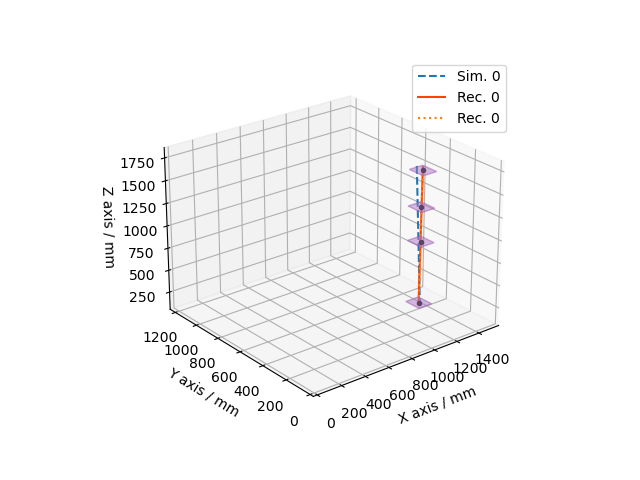
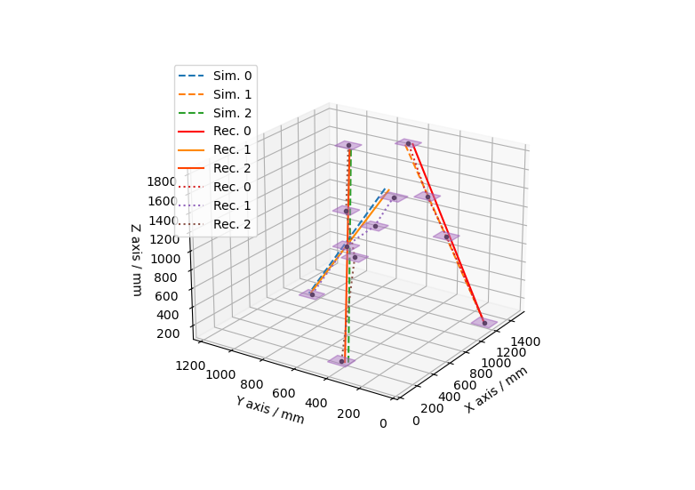

# TRAGALDABAS-Kalman-Filter

One track                     |  Three tracks
:----------------------------:|:-------------------------------:
 | 

```
Legend:

- - - Sim.: Simulated Saeta.
----- Rec.: Reconstructed Saeta
..... Rec.: Reconstructed path, from one cell center to another.

(Indices start in 0)
```

## INTRODUCTION
Code that simulates particle showers (`SimEvent` calss) and reconstructs 
their tracks from their fingerprints (`TrackFinding` class) in TRASGO detectors. 
This particle showers can be loaded (`RootUnpacker` class) from ROOT
trees with real data too.

The **TRASGO** detectors are:
  - *TRAGALDABAS:* It is composed by three (actually) plates/plans with 
    120 cells each one. At the future we hope install the fourth detector
    plane, like is simulated in this code.
  - *TRISTAN:* It is composted by four detector planes with a different number
    of cells per plane.

## REVIEW

##### GI filter for a pads detector
##### TRAGALDABAS Version X.x.x

*****************************
>April 2020. ***JA Garzon*** (JAG). labCAF / USC
>
>July 2020. *Miguel Cruces*
*****************************

## HOW TO
### Download 
Clone the repo from *GitHub* 
```bash
git clone https://github.com/MCruces-fz/TRAGALDABAS-Kalman-Filter.git
```
wherever you want.

### Configure
First you must type on your Linux terminal
```bash
cd TRAGALDABAS-Kalman-Filter
source utils/configure.sh
```
to configure make files executables and so on. Then
```bash
./trebol
```
and follow the instructions.

### Run

Execute the main file with `python3`
```bash
python3 main_script.py
```
***Note:*** Read [this](#snippet) to write your own main file.

## DOCUMENTATION

This project is based on JAG's *Genedigitana*. This means it is a software
that is able to **Generate** tracks, **Digitalize** them, and then **Analyze**
digitized tracks (reconstruction using *Tim Track*).

Here reconstruction is made by implementing *Kalman* algorithm to filter some 
unuseful tracks. Also there is a piece of the program dedicated to 3D 
representation, another to read `tryydoyhhmmss.hld.root.root` files with real 
(or simulated with ROOT) data, and several improvements to achieve flexibility. 

To read detailed documentation about this code, go [here](md/class_doc.md).

### Snippet

To use this software you can start following this steps:

1. **Simulate tracks**. There are two ways to generate a simulation, called
    - `SimEvent`: Realistic simulation. This is taking into account realistic effects such as inefficiencies.
    - `SimClunkyEvent`: A simpler simulation, which only generates and digitizes.

This first part of simulation, performs generation and digitization steps from Genedigitana.
```python
from simulation.efficiency import SimEvent

# import numpy as np
# np.random.seed(0)

sim = SimEvent()
```
Create the `sim` instance of `SimEvent` class which inherits from `Event` class, so `sim` is a
simulated event. Events are generated randomly using `numpy`, so if you want to use a
seed, uncomment those lines.

By default, it generates a number of tracks (saetas) randomly from 1 to 4 following a 
realistic [distribution](md/ntracks_distro.md), but you can choose manually how many you 
want
```python
sim = SimEvent(tracks_number=None)  # <- Same as default
sim = SimEvent(tracks_number=2)
```

2. **Find Tracks**. In the previous item, we got `sim` as the simulated and digitized 
event, so now we can find tracks from digitized hits over the detector.

There are two methods to find tracks:
- `main_loop` for realistic (`SimEvent`) events but low multiplicity.
- `execute` for `SimClunkyEvent` events but high multiplicity.

So typing this, 
```python
from reconstruction.track_reconstruction import TrackFinding

find = TrackFinding(sim)
```
we initialize the object `find` with the simulated event `sim`, but anything else. Now 
we can choose
```python
find.main_loop()
```
or
```python
find.execute()
```

Then, all information is stored in `find` object, which has those relevant attributes:
    - `sim_evt`, the simulated event same as `sim` object.
    - `rec_evt`, the reconstructed event with saetas, used hits...
both instances of `Event` class.


3. **Represent**. To represent easily those events,
```python
from represent.represent_3d import Represent3D as r3d

r3d.saetas(find.sim_evt, fig_id=0, lbl="Sim.", frmt_marker='--')
r3d.hits(find.sim_evt, fig_id=0)
r3d.saetas(find.rec_evt, fig_id=0, lbl="Rec.", frmt_color="chi2", frmt_marker='-')
r3d.lines(find.rec_evt, fig_id=0, frmt_color=None, lbl="Rec.", frmt_marker=':')
r3d.show()
```
That's it.


### Configuration File (*Outdated*)
The config.json file is the settings table for users.
- *config.json*: **settings** table for user.
    + "rd_seed": Choose an integer seed for numpy random generator, or keep 
    it random with 'None'/'null'
    + "kf_cut": Kalman Filter cut value (kf_cut = 0.6 is the most efficient)
    + "tt_cut": Tim Track cut value
    + "tracks_number": Number of generated tracks
    + "single_run":
        * "do": Do single run? (bool)
        * "plot_representations": Set if shows the 3D representation of rays 
        on the detector (bool)
        * "final_prints": Set if print final data (bool)
        * "save_diff": Set if save differences between parameters of the 
        generated and reconstructed SAETAs (See below "SAVE DIFFERENCES" 
        docstring) (bool)
    + "efficiency":
        * "do": (bool)
        * "prints": (bool)
        * "plots": (bool)
        * "save_txt": (bool)


```
-------------------   S A V E - D I F F E R E N C E S   ------------------- 
_______________________________ (save_diff) _______________________________

Set if save differences between parameters of the generated and  
reconstructed SAETAs,  
  - Sgen = [X0g, XPg, Y0g, YPg, T0g, S0g]  
  - Srec = [X0r, XPr, Y0r, YPr, T0r, S0r]
on 'saetas_file.csv'  
(X0r - X0g), (XPr - XPg), (Y0r - Y0g), (YPr - YPg), (T0r - T0g), (S0r - S0g)  
[       ...,         ...,         ...,         ...,         ...,       ... ]  
on append mode.  
---------------------------------   END   ---------------------------------- 
```


### Comments
Some coding criteria:
- The variable names, follow, in general, some mnemonic rules
- Names of vectors start with **v**
- Names of matrixes start with **m**
- Names of indices start with **i**
- Names of numbers start with **n**
********************************************************************
> **Typical units:**  
> Mass, momentum and energy in *MeV*  
> Distances in *mm*  
> Time in *ps*
********************************************************************
